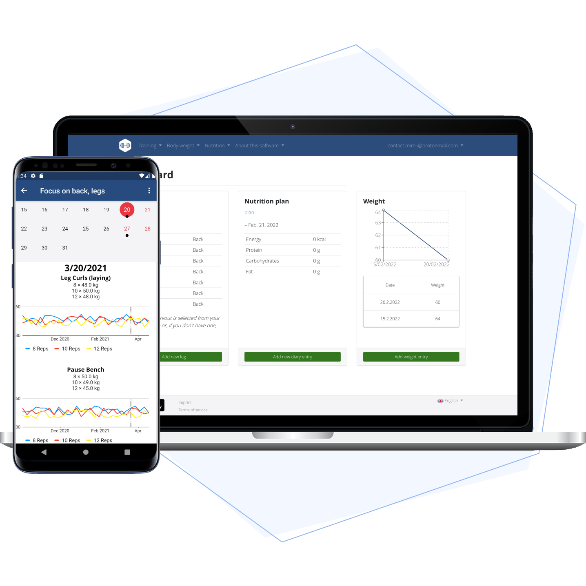
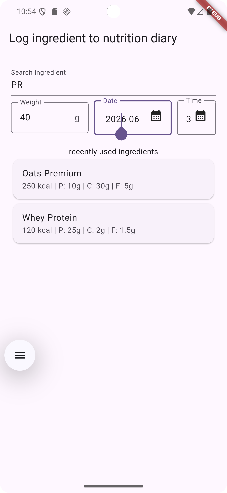
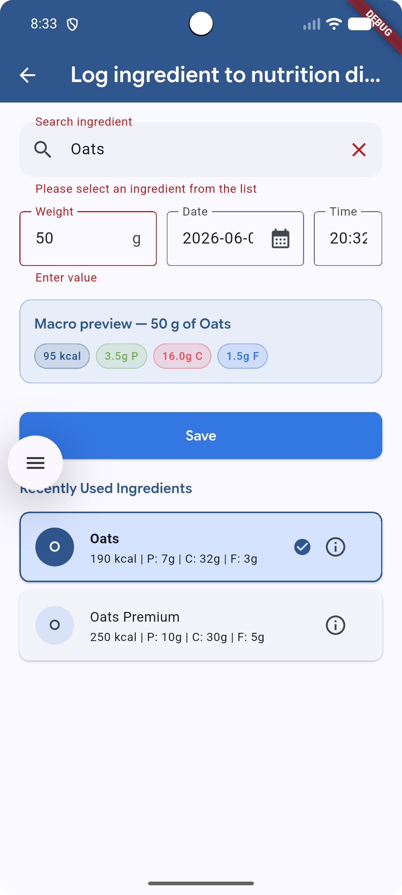
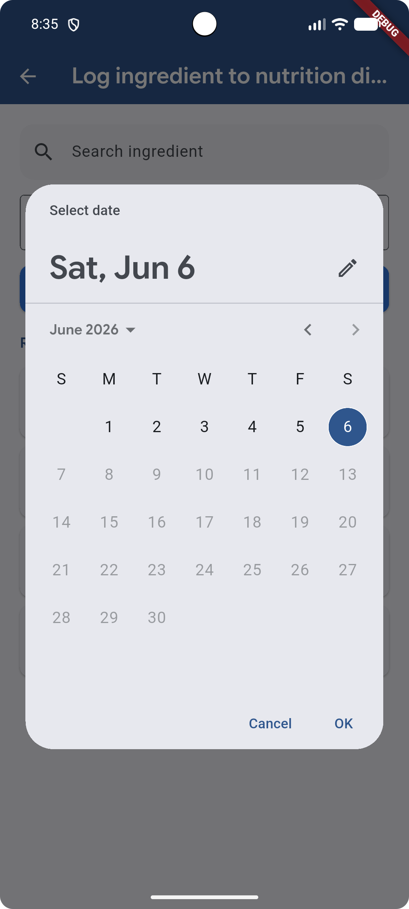
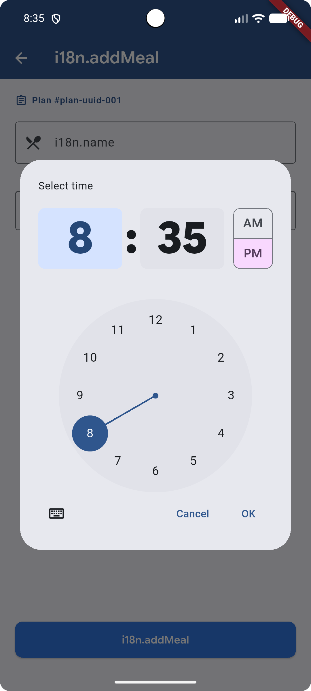
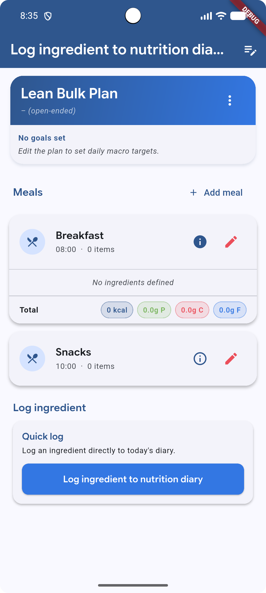

## Flutter Riverpod Frontend (`realflutter`)


> ### Flutter frontend codebase containing real-world fitness application modules (Nutritional Plans, Diary Logs, and Offline Storage) built to interface seamlessly with a Django (Python) backend.
> 


## 1. What the Project Does

`realflutter` is a cut-down version of the wger Flutter app that focuses only on the **nutrition/ingredient** module. The goal is:

1. Load a `NutritionalPlan` (list of meals + items) from the Django backend or fall back to embedded mock JSON
2. Show an `IngredientForm` where the user can search an ingredient, enter an amount, pick a date/time, and log it
3. Write the log entry into a local **Drift** SQLite database that is synced offline-first with **PowerSync**


This codebase serves as a high-performance cross-platform application built with [Flutter](https://flutter.dev) and [Riverpod](https://riverpod.dev). Unlike decoupled memory-only frontends, this implementation leverages **PowerSync** paired with **Drift** to establish robust offline-first local database caching alongside raw networking capabilities.

---

## 🛠 Architecture & State Strategy

The engineering principles behind `realflutter` isolate UI components from database and networking logic via an extensible layer:

* **Authentication & Networking:** Communicates directly with the Django backend.
* **API Pagination Strategy:** Native parsing of paginated payloads targeting specific details endpoints recursively.
* **Offline-First Persistence:** Implements a reactive data syncing framework using a unified PowerSync-backed Drift engine to stream states right into the user interface.
* **Robust Fallback Mechanisms:** Network out-of-bounds queries, unexpected timeouts, or uninitialized backends gracefully fall back onto Drift local database.
  
> ### Flutter real-world fitness application that adheres to the [first-opensource-wger-devs](https://www.google.com/search?q=https://github.com/pankaj-basnet/Flutter--first-opensource-with-wger) frontend documentation and specifications.
> 
> 


This codebase was created to demonstrate a fully responsive cross-platform (Mobile/Web) client built with [Flutter](https://flutter.dev) and [Riverpod](https://riverpod.dev) implementing state persistence, token-based session handling, offline caching strategies, and robust CRUD flows.

It serves as the flagship mobile/web frontend implementation for the `first-opensource-wger-devs` group, validating that any frontend framework can instantly snap onto any spec-compliant backend.

For more information on how this works with other [frontends/backends], head over to the [first-opensource-wger-devs Spec Repo](https://github.com/pankaj-basnet/Flutter--first-opensource-with-wger).

- RealWorld's [backend implementations](https://docs.realworld.show/specifications/backend/introduction/) adhere to their own specific [API spec](https://github.com/realworld-apps/realworld/tree/main/specs/api). The full API is described in the [OpenAPI spec]https://github.com/realworld-apps/realworld/blob/main/specs/api/openapi.yml.

#### About first-opensource-wger-devs Clones

The goal of this initiative is to create over 10 independent implementations of the same project schema (5 frontends for web/mobile, 5 backends for web/mobile). All clients and servers are completely plug-and-play interchangeable as they rigidly adhere to a singular, customized API specification modeled after the opensource [RealWorld Spec](https://www.google.com/search?q=https://docs.realworld.show/specifications).

Aimed for first-time opensource contributors/students to use production-grade architecture while ensuring they are not overwhelmed by complex dependency trees. This training blueprint focuses on how students can study the core workout and nutrition management system, `wger`, and adapt its design for an internal practice project named `realflutter`.


|  |   | Wger Project |  |  |
| :--- | :--- | :--- | :--- | :--- |
|  | [  ](https://github.com/wger-project/wger) |  Wger Opensource Fitness App ( web + mobile ) |  |  |


The `realflutter` project is a Flutter mobile application being built as a community-facing reimplementation of the `wger` fitness/nutrition platform. Its stack combines **Drift** (type-safe SQLite ORM), **PowerSync** (offline-first sync layer), **Riverpod** (state management), and **Freezed + json_serializable** (immutable data classes with codegen). This is a production-grade technology combination that demands careful architectural discipline even at the earliest stages.

- Current project is at **25% milestone** for the first frontend (flutter) implementation, which focused entirely on `forms.dart` — the `IngredientForm` widget and the `getIngredientLogForm` factory function, which is architecturally sound.

This app renders and interacts with three structural core fitness features:

* **Ingredients Dashboard:** Search, view nutritional data, and calculate custom macro ratios.
* **Exercises Directory:** Filter exercises by targeted muscle groups or equipment needed.
* **Measurements Progress Tracker:** Render visual tracking charts for weight and performance metrics over time.


## Usage

1. Clone the Git repository

```shell
  git clone git@github.com:pankaj-basnet/Flutter--first-opensource-with-wger.git
  cd realflutter

```

2. Fetch Dependencies and Run Code Generation

```shell
  flutter pub get
  dart run build_runner build --delete-conflicting-outputs

```

3. Run Application

```shell
  # Launch on your connected emulator or browser target
  flutter run

```

### Testing

* `flutter test`: Runs structural unit tests assessing state providers, models, and mock repository overrides.
* `flutter test integration_test/app_test.dart`: Executes local end-to-end user path validation sequences.

### Connect a Backend

Choose any backend system from the ecosystem directory. This client works seamlessly with all variants. The primary companion server engineered simultaneously alongside this release is:

* [backend-languages](https://github.com/pankaj-basnet/Flutter--first-opensource-with-wger)

| Feature Compatibility | Spec Compliance Status | Status Link |
| --- | --- | --- |
| Ingredients Management | Ongoing | [Spec Logs] |
| Exercises Management | Planned | [Spec Logs] |
| Measurements Trackers | Planned | [Spec Logs] |

## UI Documentation

This frontend conforms strictly to the presentation layout requirements specified in the `first-opensource-wger-devs` Frontend Format Guides. Route names, state-dependent button conditions, and authentication token headers remain identical across all 5 planned frontend iterations.

## Contributing

If you would like to contribute, please check open issues or follow these guidelines:

* Fork the repository and develop on a custom feature branch.
* Always run `dart format .` before pushing code changes.
* Ensure that modifications changing application state include corresponding Riverpod provider test evaluations.

## License

This project is open-source and released under the [MIT License]().


## Development Progress & Commit History

| SN | Screenshot A | Commit A | Screenshot B | Commit B |
| :--- | :--- | :--- | :--- | :--- |
| **1** |    | [`6d0edb7`](https://github.com/pankaj-basnet/Flutter--first-opensource-with-wger/commit/6d0edb72da7b32468218c521fcec9ac8116ed0f8) <br>•  Setup flutter project and Integrate `http` package to fetch GitHub JSON payload.<br>• Initial UI successfully renders live-fetched nutritional plan data. |  |  [`6f45b96`](https://github.com/pankaj-basnet/Flutter--first-opensource-with-wger/commit/6f45b960cac6ee604520f0d79bdefc7ac87a5cbc) <br>•  Ingredient log form with data models<br>•  Drift/powersync setup for offline mode |
| **2** |  | `[Hash]`<br>• Next feature description<br>• Next feature description |  | `[Hash]`<br>• Next feature description<br>• Next feature description |


---


##  PowerSync Offline Mode: How It Wires Together 🔌

Understanding why this works offline is important for week 2 on the wger project.

```
ONLINE (PowerSync syncing):

  Django REST API
       │  JSON over HTTP
       ▼
  PowerSync Cloud
       │  WebSocket sync protocol
       ▼
  PowerSync SQLite (local)   ← same file as Drift reads
       │
       ▼
  DriftPowersyncDatabase
  (drift_sqlite_async wraps the PowerSync SQLite connection)
       │
       ▼
  NutritionRepository (SELECT/INSERT via Drift)
       │  Stream<T>
       ▼
  StreamBuilder → UI updates automatically
```

```
OFFLINE (no internet):

  Django REST API   ✗  (unreachable)
  PowerSync Cloud   ✗  (no sync)

  PowerSync SQLite (local)   ← STILL AVAILABLE, has all cached data
       │
       ▼
  DriftPowersyncDatabase  ← queries work normally against cached SQLite
       │
       ▼
  NutritionRepository → INSERT writes to local SQLite queue
       │  Stream<T>
       ▼
  StreamBuilder → UI updates from local writes immediately ✅

  When connectivity returns → PowerSync syncs queued writes to server
```

| SN | Screenshot A | Screenshot B | Screenshot C | Screenshot D |
| :--- | :--- | :--- | :--- | :--- |
| **1** |    |    |  |     |
<!-- | **1** |    | [`6d0edb7`](https://github.com/pankaj-basnet/Flutter--first-opensource-with-wger/commit/6d0edb72da7b32468218c521fcec9ac8116ed0f8) <br>•  Setup flutter project and Integrate `http` package to fetch GitHub JSON payload.<br>• Initial UI successfully renders live-fetched nutritional plan data. |  |  [`6f45b96`](https://github.com/pankaj-basnet/Flutter--first-opensource-with-wger/commit/6f45b960cac6ee604520f0d79bdefc7ac87a5cbc) <br>•  Ingredient log form with data models<br>•  Drift/powersync setup for offline mode | -->


## Full Architecture Map 🏗️

```
main.dart
  └── ProviderScope (Riverpod — only here)
        └── powerSyncInstanceProvider (FutureProvider)
              └── DriftPowersyncDatabase (Drift over SQLite)
                    └── NutritionRepository (wraps Drift DAOs)
                          │
                    ┌─────┴──────────────────────────────────┐
                    │  watchPlan()  watchMeals()  insertLog() │
                    └───────────────────┬────────────────────┘
                                        │ Stream<T>
                          ┌─────────────▼──────────────────────┐
                          │  IngredientLogScreen (StreamBuilder)│
                          │  IngredientDetail                   │
                          │  MealSummarySection                 │
                          │  MealForm   PlanForm                │
                          └────────────────────────────────────┘

PowerSync sync layer (background):
  SQLite (local) ◄──────────────► wger Django REST API
                  PowerSync sync
                  (automatic when online)
```
