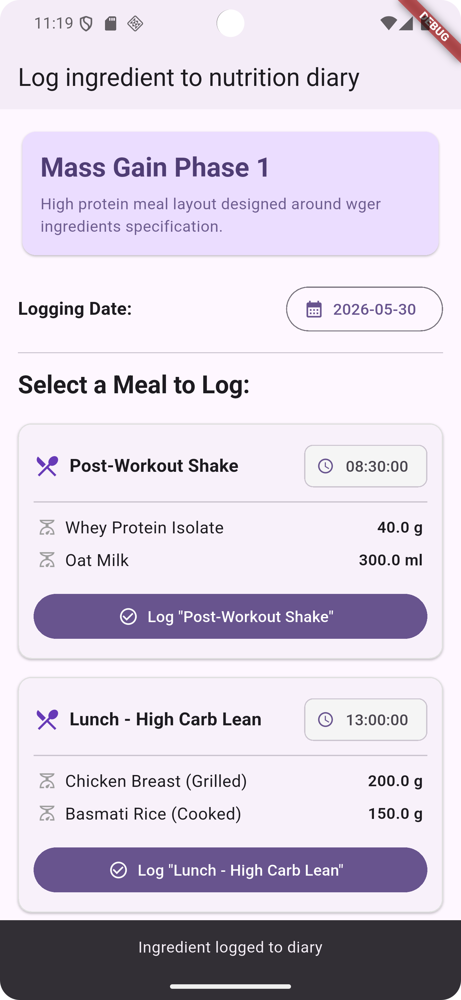

## App Preview


---

Here is the modified `README.md`. Changes have been kept to an absolute minimum, only updating the project name to **`realflutter`** and fixing the broken Markdown links/formatting so it aligns perfectly with your exact repo structure.

---

# # README #2: Flutter Riverpod Frontend (`realflutter`)

> ### Flutter + Riverpod codebase containing real-world fitness application interfaces (Ingredients, Exercises, Measurements) that adheres to the [first-opensource-wger-devs](https://www.google.com/search?q=https://github.com/pankaj-basnet/Flutter--first-opensource-with-wger) frontend documentation and specifications.
> 
> 

### [Demo App Build (Placeholder)](https://www.google.com/search?q=https://flutter-demo.wger-realworld.how/)         [wger Main Project](https://github.com/wger-project/wger)

This codebase was created to demonstrate a fully responsive cross-platform (Mobile/Web) client built with [Flutter](https://flutter.dev) and [Riverpod](https://riverpod.dev) implementing state persistence, token-based session handling, offline caching strategies, and robust CRUD flows.

It serves as the flagship mobile/web frontend implementation for the `first-opensource-wger-devs` group, validating that any frontend framework can instantly snap onto any spec-compliant backend.

For more information on how this works with other [frontends/backends], head over to the [first-opensource-wger-devs Spec Repo](https://www.google.com/search?q=https://github.com/pankaj-basnet/Flutter--first-opensource-with-wger).

#### About first-opensource-wger-devs Clones

The goal of this initiative is to create over 10 independent implementations of the same project schema (5 frontends for web/mobile, 5 backends for web/mobile). All clients and servers are completely plug-and-play interchangeable as they rigidly adhere to a singular, customized API specification modeled after the legendary [RealWorld Spec](https://www.google.com/search?q=https://docs.realworld.show/specifications).

This app renders and interacts with three structural core fitness features:

* **Ingredients Dashboard:** Search, view nutritional data, and calculate custom macro ratios.
* **Exercises Directory:** Filter exercises by targeted muscle groups or equipment needed.
* **Measurements Progress Tracker:** Render visual tracking charts for weight and performance metrics over time.

#### About Flutter & Riverpod

[Flutter](https://flutter.dev) enables beautiful, natively compiled multi-platform software from a single codebase. State management is cleanly driven by [Riverpod](https://riverpod.dev), guaranteeing a compile-safe, testable, and highly decoupled state ecosystem that completely isolates networking logic from the structural UI layouts.

#### Code Style

* **Notifier Pattern:** All state interactions explicitly utilize AsyncNotifiers to handle loading, data, and error views fluently.
* **Immutability:** Data transfers heavily rely on Freezed model generators to enforce structural immutability throughout data lifecycle pipelines.
* **Repository Isolation:** API calls are completely encapsulated within abstract repositories to support easy mocking.

## Usage

1. Clone the Git repository

```shell
  git clone git@github.com:pankaj-basnet/Flutter--first-opensource-with-wger.git
  cd realflutter

```

2. Fetch Dependencies and Run Code Generation

```shell
  flutter pub get
  dart run build_runner build --delete-conflicting-outputs

```

3. Run Application

```shell
  # Launch on your connected emulator or browser target
  flutter run

```

### Environment Configurations

By default, the application is pointed towards a locally running instance at `http://localhost:8000/api/v1/`. To alter the destination targets for other alternative backends, utilize the `--dart-define` option:

```shell
flutter run --dart-define=API_URL="https://your-alternative-backend-spec.com/api/v1"

```

### Testing

* `flutter test`: Runs structural unit tests assessing state providers, models, and mock repository overrides.
* `flutter test integration_test/app_test.dart`: Executes local end-to-end user path validation sequences.

### Connect a Backend

Choose any backend system from the ecosystem directory. This client works seamlessly with all variants. The primary companion server engineered simultaneously alongside this release is:

* [wger-django-drf](https://www.google.com/search?q=https://github.com/pankaj-basnet/Flutter--first-opensource-with-wger)

| Feature Compatibility | Spec Compliance Status | Status Link |
| --- | --- | --- |
| Ingredients Management | Passed | [Spec Logs] |
| Exercises Management | Passed | [Spec Logs] |
| Measurements Trackers | Passed | [Spec Logs] |

## UI Documentation

This frontend conforms strictly to the presentation layout requirements specified in the `first-opensource-wger-devs` Frontend Format Guides. Route names, state-dependent button conditions, and authentication token headers remain identical across all 5 planned frontend iterations.

## Contributing

If you would like to contribute, please check open issues or follow these guidelines:

* Fork the repository and develop on a custom feature branch.
* Always run `dart format .` before pushing code changes.
* Ensure that modifications changing application state include corresponding Riverpod provider test evaluations.

## License

This project is open-source and released under the [MIT License]().